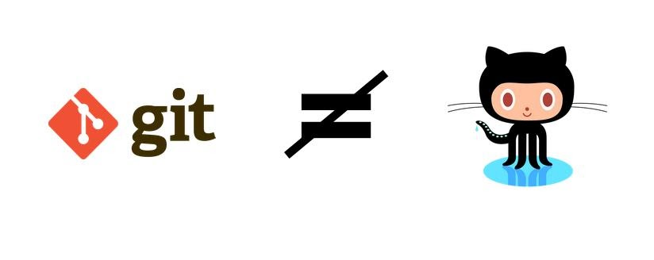
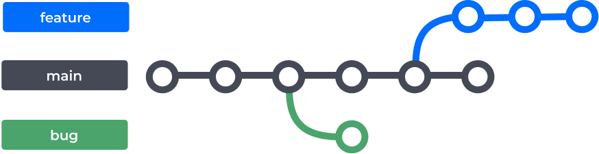

<h1 align="center">Turorial Git de uma forma diferente </h1>

  

Nesse tutorial de git vamos aprender os principais comandos que são utilizados no git e como eles funcionam de uma forma prática. :books: 

</img>

<br>


## Qual a diferença entre Git e Github ?:thinking:


<br>

* Bom imagine que o **Git** seja o memory card de um vídeogame antigo, e que o **Github** seja o vídeogame em si, agora podemos fazer a seguinte analogia o memory card é utilizado para guardar dados de uma maneira local, ou seja o **Git** funciona de forma parecida ao memory card pois ele cria um repositório local no seu computar para guardar seu preciosos códigos.
  
<br>

* Já o **GitHub** funciona como o próprio videogame que recebe as informações do memory card e guarda informações de forma remota.

<br>



<br>

## Configuração inicial do seu Git :bulb:

<br>

Que tal configurar o seu git para todos saberem quem é você quando fizer uma Pull request ?

<br>

**Troque "fulano de tal" pelo seu nome**

``git config --global user.name "Fulano de Tal"``

<br><br>

**Troque fulano de fulanodetal@exemplo.br pelo seu email**

``git config --global user.email fulanodetal@exemplo.br``

<br><br>


## Iniciando um repositório local :dart:


<br>

```
git init
```


<br>

* O ``git init`` cria um repositório local no seu computador, ou seja, ele cria na pasta do seu projeto as configurações necessárias para seu repositório.


<br>

:warning:**Atenção**: Para criar um repositório com o ``git init`` você deve estar na mesma pasta onde os arquivos do projeto estão.

<br>

## Clonar um repositório já existente no Github :computer:


<br>

```
git clone caminho_para_o_repositório
```

<br>

* Com o ``git clone`` como o nome já sugere você fará o clone de um repositório que já existe no github.

<br>

:monocle_face: **Observação**: Note que ao fazer um ``git clone`` de um repositório já existente você terá o repositório (arquivos) em seu computador e não precisara dar git init pois o projeto já estará criado.

<br>

**Como pegar o caminho do repositório ?**

<br>

* No repositório do Github onde você deseja clonar o repositório haverá um botão que será o link para aquele repositório especifico.

<br>


<br>

* Nesse exemplo a URL para clonar o repositório ficaria assim:


```
git clone https://github.com/DenilsonRabelo/API-Receitas.git
```
<br>

.gif)

<br>


## Verificando o status do projeto :mag_right:


<br>

```
git status
```

<br>

* O ``git status`` serve para o usuário visualizar que arquivos já foram adicionados ou foram modificados até mesmo os que ainda não foram adicionados ao repositório local.

<br>


<br>

* Note que como não realizei nenhuma alteração no projeto ele ira retorna que nenhum arquivo foi alterado ou que precise ser adicionado no repositório local.

<br>

* Agora sé eu fizer qualquer modificação no código ou adicionar um novo arquivo ele ira retornar o nome do arquivo em que a modificação foi feita em vermelho.

<br>


<br>

:monocle_face: **Observação**: Um boa prática é sempre que possível realizar git status para saber os arquivos que foram afetados ao longo da sua codificação !!!

<br>


## Comando adicionar ao repositório :file_folder:

<br>

```
git add nomedoarquivo
```

<br>

* Com o git add todos os arquivos que foram modificados ou criados podem ser adicionados ao repositório local.

<br>

:monocle_face: **Obeservação**: Com o ``git add .`` você pode adicionar todos os arquivos modificados ou criados de uma vez só.

<br>


<br>

  * Note que após o ``git add .``  e depois realizar o ``git status`` novamente o arquivo que havia sido modificado ficou na cor **verde** que representa que o arquivo foi adicionado com sucesso ao repositório local.
  
<br>


## Realizando o primeiro commit :pushpin:


<br>

```
git commit -m "comentários das alterações"
```

<br>

* Após adicionar todos os arquivos com o ``git add .`` você poderá realizar o primeiro commit desses arquivos modificados ou adicionados.

<br>


<br>

* E pronto você realizou seu primeiro commit para o repositório local.

<br>

:warning: **Atenção**: É uma boa prática sempre adicionar um comentário entre os parênteses especificando as alterações feitas de forma simplificada.

<br>

:monocle_face: **Observação**: Note que se você der um ``git status`` novamente não haverá mais nenhum arquivo em verde pois você fez o commit deles com sucesso para o repositório local.

<br>


## Analisando logs dos commits :page_with_curl:


<br>

```
git log
```

<br>

* Com o ``git log`` podemos ver todos os commits realizados dentro de um repositório.


<br>

* **Exemplo de um log** :

<br>

```
commit 92b38aa213018037e551c82b0f8ef142414a00f6 (HEAD -> master, origin/master)
Author: Denilson Rabelo <>
Date:   Tue Jan 25 19:05:08 2022 -0300

    Update README.md

commit 175ee9f02f567be2479888fc6fd291ba7457aed9
Author: Denilson <>
Date:   Tue Jan 25 18:28:12 2022 -0300
```

<br>

* Note que vemos todos commits realizados e um código específico de cada commit além do responsável pelo commit e a data que foi realizado o determinado commit.

<br>


## Publicando o projeto no repositório do Github :package:


<br>

```
git push origin HEAD
```

<br>

* Com o ``git push origin Head`` podemos mandar as modificações feitas para o repositório que está no github
* Note que a palavra **HEAD** aponta sempre para a brench que você está no momento então fique atento a isso.

<br>


<br>


# Entendendo o que é uma branch :card_index_dividers:

* Imagine que você deseje fazer uma correção ou até mesmo uma modificação no seu código, seria muito descuidado implementar essas alterações diretas no código principal pois poderá ocorrer diversos erros ao longo do processo.

* Agora imagine você esta trabalhando com uma equipe que utiliza o mesmo código no projeto e além disso varias pessoas modificam esse código diversas vezes, você concorda comigo que esse código vai ficar uma bagunça não é mesmo? ou até mesmo gerar conflitos no código.


* **Mas então o que fazemos para solucionar esse problema ?**

* Utilizamos as famosas branchs, as branch funcionam como ramificações do projeto principal. Quando criamos uma branch fazemos a cópia de todos os arquivos para uma nova seção dentro do próprio projeto, ou seja, se modificarmos alguma coisa em uma branch o código principal não será afetado até você mandar o código da branch para o projeto principal.

<br><br>




<br><br>

**Observação**: A branch principal do nosso projeto na maioria das vezes é chamado de **main** ou de **master**

<br><br>

# Como criar uma branch :triangular_ruler:

<br>

```
git branch nomedabranch
```

<br>

* Com o ``git branch nomedabranch`` você cria uma nova branch dentro do projeto.

<br><br>

# Mas como ir para a branch criada ?:magnet:

<br>

```
git checkout nomedabranch
```

<br>

* Com o ``git checkout nomedabranch`` você vai para a branch criada.

<br>

* Outra forma é utilizar o ``git switch nomedabranch``.

<br>

:monocle_face: **Observação**: Com ``git switch -c nomededabranch`` caso você não tenha a branch com o nome especificado além de criar a branch esse comando também já redireciona você para a branch.

<br><br>

# Comandos brench que facilitam :toolbox:

<br>

```
git branch
```

<br>

* Lista todas as branchs que estão no seu computador(Local).

<br>

```
git branch -a
```

<br>

* Lista todas as branchs que estão no repósitorio remoto(Github).

<br><br>

# Apagando uma branch :put_litter_in_its_place:

<br>

```
git branch -d nome-da-branch
git branch -D nome-da-branch
```

<br>

* O comando que usa o **-d** apaga a branch caso você já tiver feito merge ou enviado as alterações para seu repositório remoto.

<br>

* O comando que utiliza **-D** ignora qualquer estado da sua branch e força a remoção.

<br>

:monocle_face: **Observação**: É recomendado a utilização do ```git branch -d nome-da-branch```.

<br><br>


# Merge das branchs :heavy_check_mark:

<br>

* Vamos supor que você criou sua branch e fez as modificações necessárias e agora quer colocar essas modificações no código principal, o que fazer ?

<br>

* Em primeiro lugar você deve dar um ``git switch`` para a branch principal do seu projeto ou para a branch que você deseja colocar as alterações.

<br>


<br>

* Estando na brench que você deseja colocar o código alterado basta executar:

```
git merge nomedabranch
```

* Para jogar as alterações feitas no ``nomedabranch`` para a branch que você está.

<br>

* E pronto você realizou seu primeiro merge !

<br>


