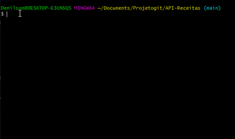

<h1 align="center">Turorial Git de uma forma diferente </h1>

  

Nesse tutorial de git vamos aprender os principais comandos que são utilizados no git e como eles funcionam de uma forma prática. :books: 

</img>

<br>


## Qual a diferença entre Git e Github ?:thinking:


<br>

* Bom imagine que o **Git** seja o memory card de um video game antigo, e que o **Github** seja o video game em si, agora podemos fazer a seguinte analogia o memory card é utilizado para guardar dados de uma maneira local, ou seja o **Git** funciona de forma parecida ao memory card pois ele cria um repositorio local no seu computar para guardar seu preciosos codigos.
  
<br>

* Já o **GitHub** funciona como o proprio video-game que recebe as informações do memory-card e guarda informações de forma remota.

<br>


## Iniciando um repositorio local


<br>

```
git init
```


<br>

* O git init cria um repositorio local no seu computador,ou seja, ele cria na pasta do seu projeto as configurações necessarias para seu repositorio.

<br>

**Atenção** : para criar um repositorio com o git init você deve estar na mesma pasta onde os arquivos do projeto estão.

<br>

## Clonar um repositorio já existente no Github


<br>

```
git clone caminho_para_o_repositório
```

<br>

* Com o git clone como o nome já sugere você fara o clone de um repositorio que já existe no github.

<br>

**Observação**: Note que ao fazer um git clone de um repositorio já existente você tera o repositorio(arquivos) em seu computador e não precisara dar git init pois o projeto já estara criado.

<br>

**Como pegar o caminho do repositorio ?**

* No repositorio do Github onde você deseja clonar o repositorio havera um botão que sera o link para aquele repositorio especifico.


<br>

Nesse exemplo a url para clonar o repositorio ficaria assim:

```
git clone https://github.com/DenilsonRabelo/API-Receitas.git
```

.gif)

<br>


## Verificando o status do projeto


<br>

```
git status
```

<br>

* O git status serve para o usuario visualizar que arquivos já foram adicionados ou foram modificados até mesmo os que ainda não foram adicionados ao repositorio local.

<br>


<br>

* Note que como não realizei nenhuma alteração no projeto ele ira retorna que nenhum arquivo foi alterado ou que precise ser adicionado no repositorio local.

<br>

* Agora sé eu fizer qualquer modificação no codigo ou adicionar um novo arquivo ele ira retornar o nome do arquivo em que a modificação foi feita em vermelho.

<br>




<br>

**Observação**: Um boa prática é sempre que possivel realizar git status para saber os arquivos que foram afetados ao longo da sua codificação !!!

<br>


## Comando de adicionar ao repositorio


```
git add nomedoarquivo
```

<br>

* Com o git add todos os arquivos que foram modificados ou criados podem ser adicionados ao repositorio local.

<br>

**Obeservação**: Com o ``git add .`` você pode adicionar todos os arquivos modificados ou criados de uma vez só.

<br>


<br>

  * Note que após o ``git add .``  e depois realizar o ``git status`` novamente o arquivo que havia sido modificado ficou na cor **verde** que representa que o arquivo foi adicionado com sucesso ao repositorio local.
  
<br>


## Realizando o primeiro commit


<br>

```
git commit -m "comentários das alterações"
```

<br>

* Após adicionar todos os arquivos com o ``git add .`` você podera realizar o primeiro commit desses arquivos modificados ou adicionados.

<br>


<br>

* E pronto você realizou seu primeiro commit para o repositorio local.

<br>

**Atenção**: É uma boa prática sempre adicionar um comentario entre os parenteses especificando as alterações feitas de forma simplificada.

<br>

**Observação**: Note que se você der um ``git status`` novamente não havera mais nenhum arquivo em verde pois você fez o commit deles com sucesso pro repositorio.

<br>


## Analisando logs dos commits


<br>

```
git log
```

<br>

* Com o ``git log`` podemos ver todos os commits realizados dentro de um repositorio.


<br>

* Note que vemos todos commits realizados e um codigo especifico de cada commit alem do responsavel pelo commit e a data que foi realizado o determinado commit.

<br>


## Publicando o projeto no repositorio do git


<br>

```
git push origin HEAD
```

<br>

* Com o ``git push origin Head`` podemos mandar as modificações feitas para o repositorio que está no github
* Note que a palavra **HEAD** aponta sempre para a brench que você está no momento então fique atento a isso.


<br>


